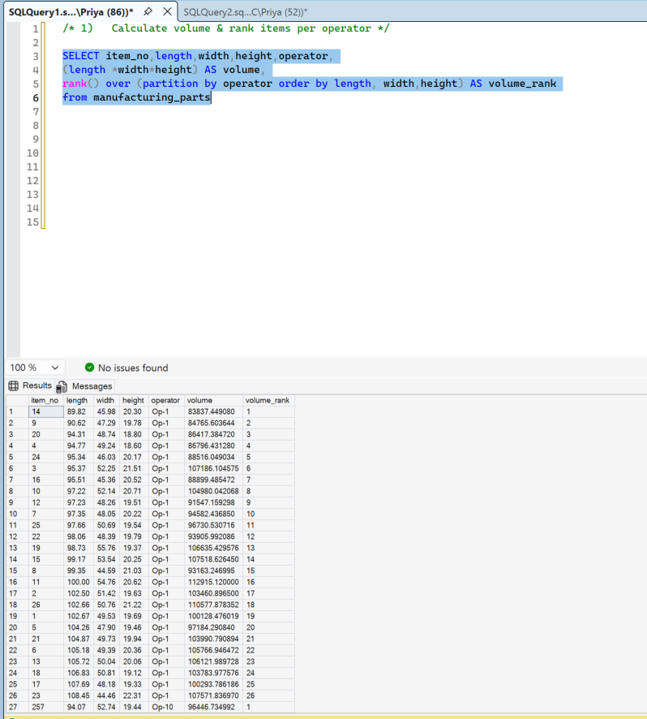
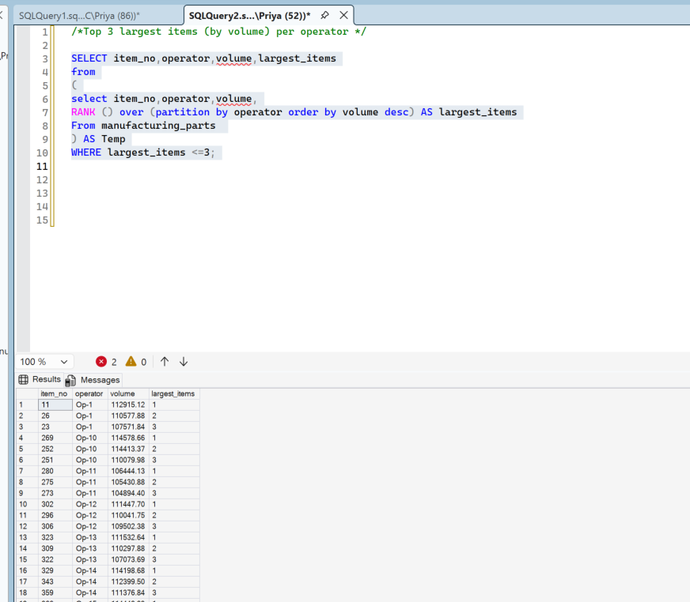
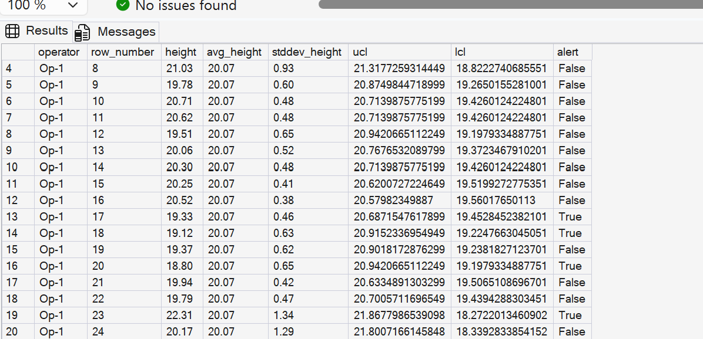

# Manufacturing Process Control with SQL

## Project context

SQL analytics portfolio project completed through hands-on training using a
provided manufacturing-parts dataset.

## Project overview

This project uses T-SQL to examine manufacturing-part dimensions and operator-level
process patterns. The analysis applies ranking, rolling calculations, Z-score checks,
and statistical process-control limits.

## Business questions

- Which parts have the largest calculated volume for each operator?
- Which operators have an average volume above the overall average?
- How do part dimensions vary from each operator's average?
- Which observations should be reviewed as possible outliers?
- Does each observation fall inside the calculated rolling control limits?

## Tools and techniques

- SQL Server and SQL Server Management Studio
- T-SQL window functions
- Common table expressions and nested queries
- Ranking and partitioned calculations
- Rolling averages
- Z-score checks
- Upper and lower control-limit calculations

## SQL files

Run the scripts in this order:

1. `sql/00_create_table.sql`
2. Import `manufacturing_parts.csv` with the SSMS Import Flat File wizard.
3. `sql/01_volume_and_rankings.sql`
4. `sql/02_operator_statistics.sql`
5. `sql/03_outliers_and_rolling.sql`
6. `sql/04_control_limits.sql`

The dataset is not included in this starter pack. Add it only if redistribution
is permitted.

## How to verify the results and finish the Key findings

Complete this section before treating the repository as final or linking it from
a résumé. Do not use the final wording until the results in SQL Server Management
Studio (SSMS) match the checks below.

### Step 1: confirm the CSV import

1. Open SQL Server Management Studio and select the project database.
2. Run `sql/00_create_table.sql`.
3. Import `manufacturing_parts.csv` into `dbo.manufacturing_parts` if it has not
   already been imported.
4. Run the final `SELECT` statement in `00_create_table.sql`.
5. Confirm that `imported_row_count` is **500**.
6. If the count is not 500, stop. Fix the import before running the analysis.

### Step 2: verify the operator-level finding

1. Open and run `sql/01_volume_and_rankings.sql`.
2. Go to the final result grid, titled in the script as operators whose average
   volume is above the overall average.
3. Confirm that the result contains exactly three operators: **Op-3**, **Op-5**,
   and **Op-17**.
4. Confirm these approximate values:

   | Check | Expected value |
   |---|---:|
   | Overall average part volume | 101,183.05 cubic units |
   | Op-3 average part volume | 112,636.29 cubic units |
   | Op-5 average part volume | 112,317.77 cubic units |
   | Op-17 average part volume | 101,564.94 cubic units |

5. Save a screenshot that shows the query and these three result rows.

This result describes average **part size**. It does not measure productivity,
quality, speed, or whether one operator performed better than another.

### Step 3: verify the rolling-average finding

1. Open and run `sql/03_outliers_and_rolling.sql`.
2. Go to the second result grid, which contains the three-item rolling average.
3. Find **Op-1, item 3**.
4. Confirm that `rolling_window_size` is `3`.
5. Confirm that `rolling_three_item_average_length` is `100.18`, allowing extra
   decimal places such as `100.180000`.
6. Save a screenshot showing Op-1 items 1, 2, and 3 and the rolling result for item 3.

Manual check:

```text
(102.67 + 102.50 + 95.37) / 3 = 100.18
```

### Step 4: verify the control-limit finding

1. Open and run `sql/04_control_limits.sql`.
2. Review the first result grid. It contains one row for every complete five-item window.
3. Review the second result grid. Find the row labelled **ALL OPERATORS**.
4. Record the displayed `complete_windows` and `alert_count` values.
5. Check several rows in the first result grid against the source data and formula.
6. Save a screenshot that shows the **ALL OPERATORS** row.

The five-item calculation includes the current observation. The documented formula
uses the rolling average plus or minus three times the rolling standard deviation
divided by the square root of five. An alert identifies an observation for review;
it does not by itself prove a defect or an unstable process.

### Step 5: complete the publication checklist

- [ ] The imported table contains 500 rows.
- [ ] Op-3, Op-5, and Op-17 are the only operators above the overall average volume.
- [ ] Op-1 item 3 has a three-item rolling average length of 100.18.
- [ ] The ALL OPERATORS complete-window and alert totals have been recorded.
- [ ] New SSMS screenshots have been saved.
- [ ] The screenshots do not expose server names, usernames, or confidential data.
- [ ] Devipriya can explain what each calculation means and does not mean.

If any result does not match, do not publish the wording below. Check that the
correct CSV was imported, the table contains 500 rows, numeric columns have the
right data types, and the scripts were run without edits.

## Example images







## Key findings

Publish the following wording only after every verification checkbox above is complete:

- Three of the 20 operators, Op-3, Op-5, and Op-17, had average part volumes
  above the dataset-wide average. Op-3 had the highest average part volume at
  approximately 112,636 cubic units, compared with the overall average of
  approximately 101,183. This describes differences in average part size; it
  does not mean that one operator performed better than another.

- For Op-1, the first complete three-item window, items 1 through 3, produced a
  rolling average length of 100.18 units. The rolling calculation smooths
  individual row-to-row changes and makes short-term patterns easier to review.

- The five-item control-limit query calculated a rolling average, rolling standard
  deviation, upper limit, lower limit, and alert flag for each complete window.
  The exact complete-window and alert totals will be added after the uploaded SQL
  script has been re-run and checked in SQL Server Management Studio.

## Repository contents

- `sql/` - T-SQL setup and analysis scripts
- `images/` - selected query and result screenshots from the final write-up
- `SQL_Manufacturing_Process_Control.docx` - project report and query screenshots

## Files to add after verification

- `project-report.pdf` - verified PDF export of the project report
- `data/` - provided CSV data, only if redistribution is permitted

## Data and limitations

The provided case-study dataset supports the SQL analysis shown here. A statistical
alert identifies an observation for investigation; it does not by itself prove a
defect, operator error, or process failure.
